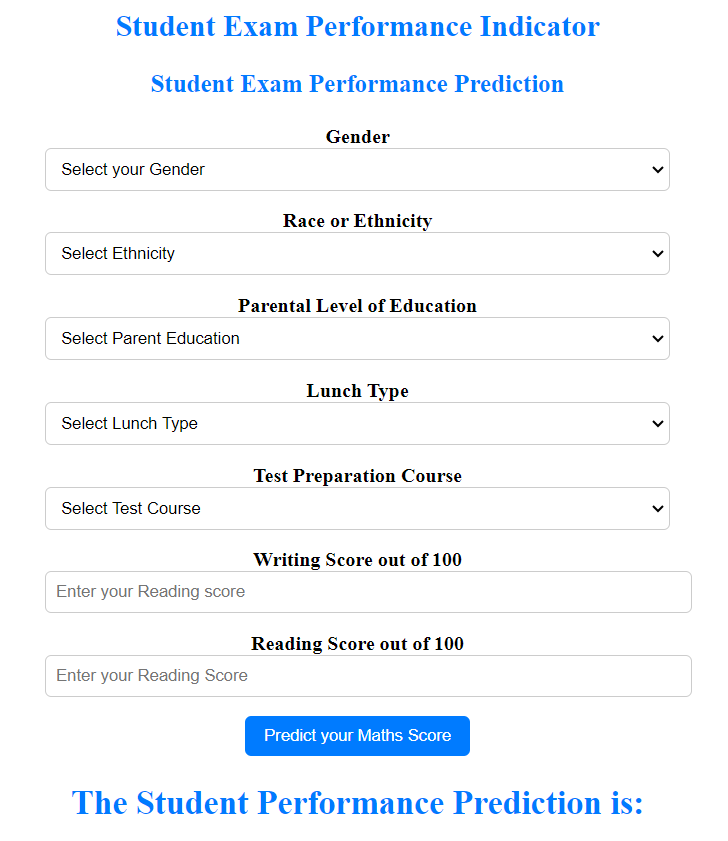

## End to End Machine Learning Project

A web-based tool called "Student Exam Performance Indicator" seeks to forecast a student's exam success based on a number of variables. The initiative gathers data on the student's gender, colour or ethnicity, parental education level, lunch choice, test preparation course, and writing and reading test scores.

Students can input their information into the application's user-friendly interface to get a prediction of how they will fare on the test. A predictive model is used to generate the prediction, and it uses the gathered data as input.

The project's goal is to help students comprehend and foresee how they might fare on exams. The application seeks to shed light on how several aspects, including gender, race or ethnicity, parental education, and other characteristics, may affect a student's performance.

## Web Application 

Student Exam Performance Indicator using (FLASK)

